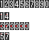
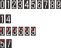
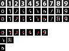

# OCR Algorithm

## はじめに

FEZのスコア画面や文字サイズが解像度に依存せず、常に一定の大きさであることを利用して、ピクセルの色のパターンから文字(数字)を判別する方法を採用しています。  
[合計スコア部分・詳細スコア部分・キル数などの部分](./img/score_sample.png)の計3か所で使用されているフォントが異なるため、それぞれの部分ごとに専用のアルゴリズムを用いています。  
また、マップ名とスキル名部分は取りうるパターン数が固定のため、事前にその部分の画像を用意し、その画像と完全一致するものを検索しています。  

> 既存のOCR技術の利用について  
> OCRライブラリ(Tesseract等)：誤認識率が高かったため不採用  
> クラウドサービス(GoogleCloudVision等)：料金面等から不採用

## 詳細スコア部分のアルゴリズム

画像をy=0の列を走査し、#FFFFFFのピクセルをまず見つける（以降このピクセルを「先頭ピクセル」とする）。  
そこから右方向に何ピクセル#FFFFFが連続しているかで3つのグループ(1, 2, 4px)に分類する。  
さらにそこから、各グループ毎に異なるアルゴリズムで分類する。  

* 1px
	* 先頭ピクセルから(-1, +2)pxの色が#FFFFFFかどうか
		* true :4
		* false:1
* 2px
	* 先頭ピクセルから(-1, +3), (-1, +4), (-1, +5), (0, +4)pxの色がそれぞれ#FFFFFFかどうか
		* true,  true,  true,  true :6
		* true,  true,  true,  false:0
		* true,  false, true,  true :8
		* true,  false, false, true :9
		* false, false, false, false:2
		* false, false, false, true :3
* 4px
	* 先頭ピクセルから(0, +1)pxの色が#FFFFFFかどうか
		* true :5
		* false:7

チェックするピクセル一覧(赤色部分)  

## 合計スコア部分のアルゴリズム

画像をy=0の列を走査し、#FFFFFFのピクセルをまず見つける（以降このピクセルを「先頭ピクセル」とする）。  
そこから右方向に何ピクセル#FFFFFが連続しているかで3つのグループ(1, 3, 5px)に分類する。  
さらにそこから、各グループ毎に異なるアルゴリズムで分類する。  

* 1px
	* 先頭ピクセルから(-1, +2)pxの色が#FFFFFFかどうか
		* true :4
		* false:1
* 3px
	* 先頭ピクセルから(-1, +4), (-1, +5), (-1, +6), (0, +5)pxの色がそれぞれ#FFFFFFかどうか
		* true,  true,  true,  true :6
		* true,  true,  true,  false:0
		* true,  false, true,  true :8
		* true,  true,  false, false:9
		* false, false, false, false:2
		* false, false, false, true :3
* 5px
	* 先頭ピクセルから(0, +1)pxの色が#FFFFFFかどうか
		* true :5
		* false:7

チェックするピクセル一覧(赤色部分)  

## キル数部分のアルゴリズム

まず画像を二値化(#FFFFFF以外を#000000に)する。
画像をy=5の列を走査し、#FFFFFFのピクセルをまず見つける（以降このピクセルを「先頭ピクセル」とする）。  
そこから右方向に何ピクセル#FFFFFが連続しているかで2つのグループ(1, 2, 3px)に分類する。  
さらにそこから、各グループ毎に異なるアルゴリズムで分類する。

* 1px
    * 先頭ピクセルから(+1, -1), (0. +1), (+1, +1), (+1, +2)pxの色がそれぞれ#FFFFFFかどうか
        * true , true , false, true :0
        * false, true , true , false:9
        * false, true , false, false:1
        * false, false, true , false:3
        * false, false, false, false:4
        * true , true , false, false
            * 先頭ピクセルから(+1, -2)pxの色が#FFFFFFかどうか
                * true :7
                * false:2
* 2px
    * 先頭ピクセルから(0, +3)pxの色が#FFFFFFかどうか
        * true :8
        * false:5
* 3px
    * 6
    
二値化後の画像とチェックするピクセル一覧(赤色部分)  

## マップ名部分のアルゴリズム

事前に手動で各マップの画像を撮影する。そして、マップ名表示部分を切り出した上で0x000000以外のピクセルを0xFFFFFFに変換した画像を用意する(Resource/MapNameBitmap内の画像)。  
その画像のMD5と、上記と同じ切り出し→変換を行った対象の画像のMD5を比較して、完全一致するものを検索する。  
なお、マップ名の画像撮影が面倒なため、中央大陸以外は対象外(不明と表示)としている。  

## スキル名部分のアルゴリズム
事前に手動で各スキルの画像を撮影する。そして、スキル名表示部分を切り出した画像を用意する(Resource/SkillBitmap内の画像)。  
その画像のMD5と、上記と同じ切り出し→変換を行った対象の画像のMD5を比較して、完全一致するものを検索する。  
なお、セスタスのゲイザーの溜め中といったスキル表示部分が時間経過で切り替わるものは面倒なため対象外(不明と表示)としている。
