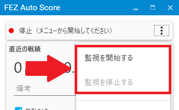
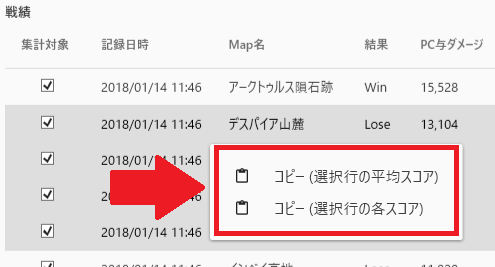

  

## はじめに
FEZ Auto Scoreは、FEZの戦績結果を自動的に解析・保存するためのツールです。  

解析はFEZの画面を一定間隔でキャプチャ(スクリーンショットを撮影)し、その画像内の数字を解析しています。  
詳細な仕組み・アルゴリズムについては、[こちら](OCR_Algorithm)を参照してください(開発者向け)。

## Download
[ダウンロード先](https://github.com/saipan-fez/fez_auto_score/releases) **(現在β版です)**  
  
上記リンクの `fez_auto_score.zip` からダウンロード可能です。  
**なお、下記の「利用にあたって」「初期設定」は必ず確認してください。**
  
旧バージョンからアップデートする場合は、上書きコピーで問題ありません。  
※score.dbは各種スコアを保存しているファイルですので、ご注意ください。
  
不具合、新機能の要望やアイディアがありましたら、[issues](https://github.com/saipan-fez/fez_auto_score/issues)または[Twitter](https://twitter.com/saipan_fez)にご連絡ください。

## 利用にあたって
**ご利用は自己責任でお願いします。**  
当ツールの利用により利用者または第三者に生じた損害や不利益トラブルについて、  
作成者はその一切の責任を負いません。

## 現在確認されている不具合
* 特定の環境で一部の情報(国名・攻守・職業・スキル)が取得できない
* フルスクリーン環境でツールを実行するとエラーメッセ―ジが表示される（スコアが取得できない）

## 初期設定
**下記の設定を必ず行ってください。設定が異なる場合、ツールが正しく動作しません。**  

1. **<u>ウィンドウ色を「通常」に変更する</u>**
    1. クライアントを起動
    2. 「OPTION」ボタンを押下
    3. 「カラー」タブに移動
    4. ウィンドウカラーを「通常」に変更
    5. 「閉じる」ボタンを押下
2. **<u>フルスクリーン設定を「OFF」に変更する</u>**
    1. クライアントを起動
    2. 「OPTION」ボタンを押下
    3. 「スクリーンサイズ」タブに移動
    4. 「フルスクリーンで表示」をOFFに変更
    5. 「閉じる」ボタンを押下
3. **<u>戦績結果の「詳細表示」をONにする</u>**
    1. 戦績結果画面を表示（通常通りプレイする）
    2. 左下の 「詳細表示」をON にする

## 機能・使い方
### 1. スコア保存

  

ウィンドウ上部が「監視中」となっている状態であれば、自動的にスコアは記録されます。  
記録を停止したい場合は、メニューを開き「監視を停止する」を選択してください。  
反対に再開したい場合は、メニューを開き「監視を開始する」を選択してください。  

> 初回起動時は停止状態のため、手動で開始してください。

### 2. スコアをコピーする

  

戦績の一覧で選択した行のスコアをクリップボードにコピーします。  

1. 戦績の一覧からコピーしたい行を選択する  ※複数行選択はShift/Ctrlキーを押しながら
2. 右クリックする
3. 「コピー(選択行の平均スコア)」または「コピー(選択行の各スコア)」を選択する
4. クリップボードにコピーされます

> 集計対象にチェックが入っていない行は除外されます。  
> なお、テキストの書式は「設定」から変更できます。

### 3. CSV出力
CSV形式で全ての戦績をファイルに出力します。  
出力したファイルはエクセルなど表計算ソフトで表示可能です。  

> CSV出力時は集計対象にチェックが入っていない項目も出力されます。

### 4. 直近のスコアをテキストに出力
新たな戦績を検知した際にスコアをテキストファイルに出力します。  
生放送でスコアを画面に表示したい際などにご使用ください。  

> 生放送で表示する方法は「配信ソフト名+テキストファイル」などで検索して設定してください。  
> なお、テキストの書式は「設定」から変更できます。

### 5. 設定

|項目名|説明|
|:-----|:---|
|戦績画像を自動保存する|新たな戦績を検知した際にスコア画像を保存するかどうか 保存先：Picture\fez_screenshotフォルダ|
|直近の戦績をテキストに出力する|新たな戦績を検知した際にテキストで保存するかどうか 保存先：Document\fez_auto_score\LatestScore.txt|
|書式 - 選択行の平均スコア|「コピー(選択行の平均スコア)」選択時の書式|
|書式 - 選択行の各スコア|「コピー(選択行の各スコア)」選択時の書式|
|書式 - 直近の戦績をテキストに出力する|LatestScore.txtに書き込む書式|

#### 5.1 書式について
下記の文字はそれぞれ各スコアに置き換えて出力されます。

##### 選択行の平均スコア

|書式|説明|
|:---|:---|
|{戦争数}|平均算出時の戦争数|
|{勝率}|勝利した戦争数のパーセンテージ|
|{平均戦争時間}|戦争時間の平均|
|{平均戦闘}|戦闘の平均|
|{平均領域}|領域の平均|
|{平均支援}|支援の平均|
|{平均PC与ダメージ}|PCDの平均|
|{平均PC与ダメージ_K}|PCDの平均（単位:k）|
|{平均キルダメージボーナス}|キルダメージボーナスの平均|
|{平均召喚解除ボーナス}|召喚解除ボーナスの平均|
|{平均建築与ダメージ}|建築与ダメージの平均|
|{平均建築与ダメージ_K}|建築与ダメージの平均（単位:k）|
|{平均領域破壊ボーナス}|領域破壊ボーナスの平均|
|{平均領域ダメージボーナス}|領域ダメージボーナスの平均|
|{平均貢献度}|貢献度の平均|
|{平均クリスタル運用ボーナス}|クリスタル運用ボーナスの平均|
|{平均召喚行動ボーナス}|召喚行動ボーナスの平均|
|{平均キル数}|キル数の平均|
|{平均デッド数}|デッド数の平均|
|{平均建築数}|建築数の平均|
|{平均建築物破壊数}|建築物破壊数の平均|
|{平均クリスタル採掘量}|クリスタル採掘量の平均|

##### 選択行の各スコア・直近の戦績をテキストに出力する

|書式|説明|
|:---|:---|
|{勝敗}|戦争の勝敗|
|{攻守}|攻撃側・防衛側どちらの参戦か|
|{攻撃側国名}|攻撃側の国名|
|{防衛側国名}|防衛側の国名|
|{マップ名}|マップ名|
|{職業}|職業名|
|{戦争時間}|戦争時間|
|{戦闘}|戦闘|
|{領域}|領域|
|{支援}|支援|
|{PC与ダメージ}|PCD|
|{PC与ダメージ_K}|PCD（単位:k）|
|{キルダメージボーナス}|キルダメージボーナス|
|{召喚解除ボーナス}|召喚解除ボーナス|
|{建築与ダメージ}|建築与ダメージ|
|{建築与ダメージ_K}|建築与ダメージ（単位:k）|
|{領域破壊ボーナス}|領域破壊ボーナス|
|{領域ダメージボーナス}|領域ダメージボーナス|
|{貢献度}|貢献度|
|{クリスタル運用ボーナス}|クリスタル運用ボーナス|
|{召喚行動ボーナス}|召喚行動ボーナス|
|{キル数}|キル数|
|{デッド数}|デッド数|
|{建築数}|建築数|
|{建築物破壊数}|建築物破壊数|
|{クリスタル採掘量}|クリスタル採掘量|
|{スキル1}|スキルスロット1番目のスキル|
|{スキル2}|スキルスロット2番目のスキル|
|{スキル3}|スキルスロット3番目のスキル|
|{スキル4}|スキルスロット4番目のスキル|
|{スキル5}|スキルスロット5番目のスキル|
|{スキル6}|スキルスロット6番目のスキル|
|{スキル7}|スキルスロット7番目のスキル|
|{スキル8}|スキルスロット8番目のスキル|

## FAQ

（のちほど書きます）
